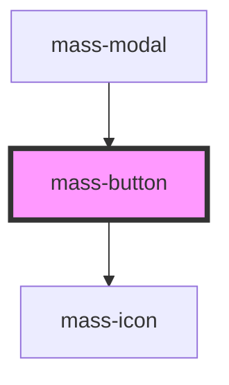

# mass-button

<!-- Auto Generated Below -->

## Properties

| Property     | Attribute     | Description                                                             | Type      | Default     |
| ------------ | ------------- | ----------------------------------------------------------------------- | --------- | ----------- |
| `iconName`   | `icon-name`   | Name of the icon to be displayed on the left side of the button         | `string`  | `""`        |
| `isDisabled` | `is-disabled` | If true, button will be disabled                                        | `boolean` | `false`     |
| `isDropdown` | `is-dropdown` | If true, button will have a dropdown icon                               | `boolean` | `false`     |
| `isRounded`  | `is-rounded`  | If true, will have a border-radius of 4px, else will have rounded edges | `boolean` | `false`     |
| `size`       | `size`        | select size of button small \| medium \| large                          | `string`  | `'medium'`  |
| `type`       | `type`        | Select theme of button, color, hover color                              | `string`  | `"default"` |

## Events

| Event       | Description                              | Type               |
| ----------- | ---------------------------------------- | ------------------ |
| `massClick` | Event emitted when the button is clicked | `CustomEvent<any>` |

## Dependencies

### Used by

 - [mass-modal](../mass-modal)

### Depends on

- [mass-icon](../mass-icon)

### Graph

----------------------------------------------

*Built with [StencilJS](https://stenciljs.com/)*
