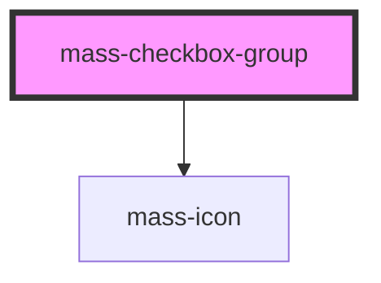

# mass-checkbox-group

<!-- Auto Generated Below -->

## Properties

| Property                  | Attribute     | Description                                                                                                                 | Type                   | Default     |
| ------------------------- | ------------- | --------------------------------------------------------------------------------------------------------------------------- | ---------------------- | ----------- |
| `checkboxId` _(required)_ | `checkbox-id` | Provide custom textbox id string.                                                                                           | `string`               | `undefined` |
| `checked`                 | `checked`     | Indicates whether the checkbox is checked or not. Defaults to false.                                                        | `boolean \| boolean[]` | `false`     |
| `errorMsg`                | `error-msg`   | The error message to display when isError is true. Defaults to "Error Explanation Text".                                    | `string`               | `undefined` |
| `isDisabled`              | `is-disabled` | Is field disabled.                                                                                                          | `boolean`              | `false`     |
| `isError`                 | `is-error`    | Indicates if there is an error. If true, an error message and icon will be displayed below the checkbox. Defaults to false. | `boolean`              | `false`     |
| `label`                   | `label`       | The label title that will be displayed above the checkbox options. Defaults to "".                                          | `string`               | `""`        |
| `text`                    | `text`        | The text that will be displayed beside the checkbox.                                                                        | `string \| string[]`   | `undefined` |

## Events

| Event        | Description                                                            | Type               |
| ------------ | ---------------------------------------------------------------------- | ------------------ |
| `massChange` | The function to be called when changes are made to the checkbox state. | `CustomEvent<any>` |

## Dependencies

### Depends on

- [mass-icon](../mass-icon)

### Graph

----------------------------------------------

*Built with [StencilJS](https://stenciljs.com/)*
