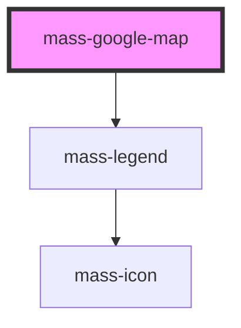

# mass-google-map

<!-- Auto Generated Below -->

## Properties

| Property      | Attribute | Description | Type                                                                                                                           | Default                                  |
| ------------- | --------- | ----------- | ------------------------------------------------------------------------------------------------------------------------------ | ---------------------------------------- |
| `center`      | --        |             | `{ lat: number; lng: number; }`                                                                                                | `{ lat: 39.9654502, lng: -105.1241617 }` |
| `coordinates` | --        |             | `{ lat: number; lng: number; isDC?: number; isCELL?: number; isPOP?: number; wirelessReady?: number; fiberReady?: number; }[]` | `[]`                                     |
| `legend`      | --        |             | `MassLegendItemType[]`                                                                                                         | `[]`                                     |
| `zoom`        | `zoom`    |             | `number`                                                                                                                       | `undefined`                              |

## Dependencies

### Depends on

- [mass-legend](../mass-legend)

### Graph

----------------------------------------------

*Built with [StencilJS](https://stenciljs.com/)*
