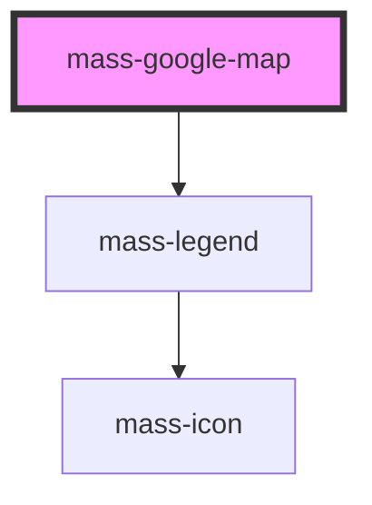

# mass-google-map

<!-- Auto Generated Below -->

## Properties

| Property      | Attribute | Description | Type                              | Default                          |
| ------------- | --------- | ----------- | --------------------------------- | -------------------------------- |
| `center`      | --        |             | `{ lat: number; lng: number; }`   | `{ lat: -34.397, lng: 150.644 }` |
| `coordinates` | --        |             | `{ lat: number; lng: number; }[]` | `[]`                             |
| `legend`      | --        |             | `MassLegendItemType[]`            | `[]`                             |

## Dependencies

### Depends on

- [mass-legend](../mass-legend)

### Graph

----------------------------------------------

*Built with [StencilJS](https://stenciljs.com/)*
