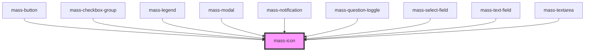

# mass-icon

<!-- Auto Generated Below -->

## Properties

| Property                | Attribute           | Description                                                                                                                                                                                                                                                                                                                                                                                                                                                                          | Type      | Default               |
| ----------------------- | ------------------- | ------------------------------------------------------------------------------------------------------------------------------------------------------------------------------------------------------------------------------------------------------------------------------------------------------------------------------------------------------------------------------------------------------------------------------------------------------------------------------------ | --------- | --------------------- |
| `altText`               | `alt-text`          | The alt text that should be announced to screen readers and other assistive technology.  Used in the `aria-label` attribute of the icon.  Works with the `isPresentational` prop.                                                                                                                                                                                                                                                                                                    | `string`  | `undefined`           |
| `color`                 | `color`             | The color of the icon.  Maps to the class names in `/src/common/scss/colors.scss`, which are driven by the names in the Design Tokens defined in Figma.  Used in the `class` attribute of the icon.  Color page in Figma: https://www.figma.com/file/DM0lok3Yv46sK6LiJflDrm/mass-Hydrogen-Design-System?type=design&node-id=273-5&mode=design                                                                                                                                        | `string`  | `'neutral-black-100'` |
| `fill`                  | `fill`              | The fill state of the icon. Used in the `font-variation-settings` CSS property set via the icon's `style` attribute.  Defaults to 0 (outlined).  Possible values: 0 (outlined) \| 1 (filled)  https://m3.material.io/styles/icons/applying-icons#ebb3ae7d-d274-4a25-9356-436e82084f1f                                                                                                                                                                                                | `number`  | `0`                   |
| `grade`                 | `grade`             | The grade of the icon. Used in the `font-variation-settings` CSS property set via the icon's `style` attribute.  Defaults to 0.  Possible values: -25 to 100.  https://m3.material.io/styles/icons/applying-icons#3ad55207-1cb0-43af-8092-fad2762f69f7                                                                                                                                                                                                                               | `number`  | `0`                   |
| `iconName` _(required)_ | `icon-name`         | The name of the icon, in lower_snake_case.  This is the name of the icon as it appears in the Material Symbols library in Google Fonts.  Example: Chevron Right (chevron_right) https://fonts.google.com/icons?selected=Material+Symbols+Outlined:chevron_right:FILL@0;wght@400;GRAD@0;opsz@24                                                                                                                                                                                       | `string`  | `undefined`           |
| `iconStyle`             | `icon-style`        | The style of the icon.  Maps to the font styles in the Material Symbols library in Google Fonts.  Possible values: "rounded" \| "sharp" \| "outlined"  https://fonts.google.com/icons                                                                                                                                                                                                                                                                                                | `string`  | `'rounded'`           |
| `isPresentational`      | `is-presentational` | Determines whether the icon should be announced to screen readers and other assistive technology.  Defaults to true.  Works with the `altText` prop.  If true, sets the `role="presentation"` attribute on the icon and the `aria-label` attribute to undefined. The icon will not be announced. If false, sets the `role` attribute to undefined and the `aria-label` attribute to the value of the `altText` prop. The icon will be announced using the value of iconAltText prop. | `boolean` | `true`                |
| `opticalSize`           | `optical-size`      | Optical size of the font. Used in the `font-variation-settings` CSS property set via the icon's `style` attribute.  Allows the image to look the same at different font sizes by adjusting the thickness of the lines.  https://m3.material.io/styles/icons/applying-icons#b41cbc01-9b49-4a44-a525-d153d1ea1425                                                                                                                                                                      | `number`  | `24`                  |
| `weight`                | `weight`            | Weight of the font. Used in the `font-variation-settings` CSS property set via the `icon's style` attribute.  Possible values: 100-700, increments of 100.  Defaults to 400 (Regular).  100: Thin, 200: Extra Light, 300: Light, 400: Regular, 500: Medium, 600: Semi Bold, 700: Bold  https://m3.material.io/styles/icons/applying-icons#d7f45762-67ac-473d-95b0-9214c791e242                                                                                                       | `number`  | `400`                 |

## Dependencies

### Used by

 - [mass-button](../mass-button)
 - [mass-checkbox-group](../mass-checkbox)
 - [mass-legend](../mass-legend)
 - [mass-modal](../mass-modal)
 - [mass-notification](../mass-notification)
 - [mass-question-toggle](../mass-question-toggle)
 - [mass-select-field](../mass-select-field)
 - [mass-text-field](../mass-text-field)
 - [mass-textarea](../mass-textarea)

### Graph

----------------------------------------------

*Built with [StencilJS](https://stenciljs.com/)*
