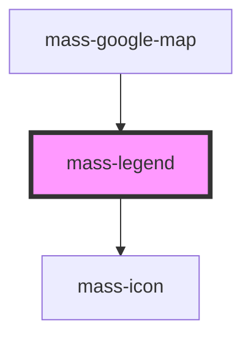

# mass-legend

<!-- Auto Generated Below -->

## Properties

| Property | Attribute | Description | Type                   | Default |
| -------- | --------- | ----------- | ---------------------- | ------- |
| `items`  | --        |             | `MassLegendItemType[]` | `[]`    |

## Dependencies

### Used by

 - [mass-google-map](../mass-google-map)

### Depends on

- [mass-icon](../mass-icon)

### Graph

----------------------------------------------

*Built with [StencilJS](https://stenciljs.com/)*
