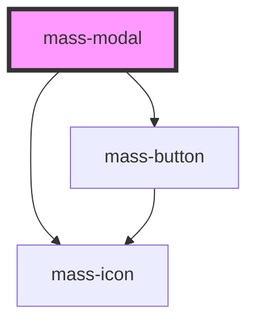

# mass-modal

<!-- Auto Generated Below -->

## Properties

| Property           | Attribute            | Description                                                   | Type      | Default     |
| ------------------ | -------------------- | ------------------------------------------------------------- | --------- | ----------- |
| `firstButtonText`  | `first-button-text`  | Text for the first button. If null, the button won't render.  | `string`  | `undefined` |
| `isVisible`        | `is-visible`         | State to manage the visibility of the modal                   | `boolean` | `false`     |
| `modalTitle`       | `modal-title`        | Title of the modal                                            | `string`  | `''`        |
| `secondButtonText` | `second-button-text` | Text for the second button. If null, the button won't render. | `string`  | `undefined` |

## Events

| Event                 | Description                                     | Type               |
| --------------------- | ----------------------------------------------- | ------------------ |
| `closeModal`          | Event emitted when the modal is closed          | `CustomEvent<any>` |
| `firstButtonClicked`  | Event emitted when the first button is clicked  | `CustomEvent<any>` |
| `secondButtonClicked` | Event emitted when the second button is clicked | `CustomEvent<any>` |

## Methods

### `hide() => Promise<void>`

#### Returns

Type: `Promise<void>`

### `show() => Promise<void>`

#### Returns

Type: `Promise<void>`

### `toggleModal(show: boolean) => Promise<void>`

#### Returns

Type: `Promise<void>`

## Dependencies

### Depends on

- [mass-icon](../mass-icon)
- [mass-button](../mass-button)

### Graph

----------------------------------------------

*Built with [StencilJS](https://stenciljs.com/)*
