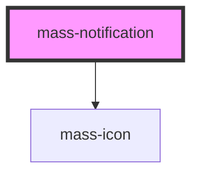

# mass-notification

<!-- Auto Generated Below -->

## Properties

| Property                    | Attribute       | Description                                                                                                                                                                       | Type     | Default     |
| --------------------------- | --------------- | --------------------------------------------------------------------------------------------------------------------------------------------------------------------------------- | -------- | ----------- |
| `altText` _(required)_      | `alt-text`      | The alt text that should be announced to screen readers and other assistive technology.  Used in the `aria-label` attribute of the icon.  Works with the `isPresentational` prop. | `string` | `undefined` |
| `headingLevel` _(required)_ | `heading-level` | Sets the heading level for the <h*> tag.                                                                                                                                          | `number` | `undefined` |
| `headingText` _(required)_  | `heading-text`  | Sets the text for the heading in the notification.                                                                                                                                | `string` | `undefined` |
| `iconName` _(required)_     | `icon-name`     | Sets the icon to be displayed with the notification.                                                                                                                              | `string` | `undefined` |
| `priority`                  | `priority`      | Sets the priority level for the notification.  Defaults to 'low'.                                                                                                                 | `string` | `"low"`     |

## Dependencies

### Depends on

- [mass-icon](../mass-icon)

### Graph

----------------------------------------------

*Built with [StencilJS](https://stenciljs.com/)*
