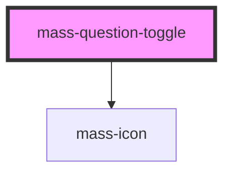

# mass-question-toggle

<!-- Auto Generated Below -->

## Properties

| Property                        | Attribute            | Description                                                      | Type     | Default     |
| ------------------------------- | -------------------- | ---------------------------------------------------------------- | -------- | ----------- |
| `defaultValue`                  | `default-value`      | Default value of the selected options radio input                | `string` | `undefined` |
| `iconName` _(required)_         | `icon-name`          | Name of icon to present left of the legend text                  | `string` | `undefined` |
| `label` _(required)_            | `label`              | Label for the radio group                                        | `string` | `undefined` |
| `labelId` _(required)_          | `label-id`           | Id used for the label and labeledBy attribute for the radiogroup | `string` | `undefined` |
| `optionOneId` _(required)_      | `option-one-id`      | Id of the first options input radio and label                    | `string` | `undefined` |
| `optionOneLabel` _(required)_   | `option-one-label`   | Label text of the first option                                   | `string` | `undefined` |
| `optionOneValue` _(required)_   | `option-one-value`   | Value of the first options input radio when selected             | `string` | `undefined` |
| `optionTwoId` _(required)_      | `option-two-id`      | Id of the second options input radio and label                   | `string` | `undefined` |
| `optionTwoLabel` _(required)_   | `option-two-label`   | Text of the second options label                                 | `string` | `undefined` |
| `optionTwoValue` _(required)_   | `option-two-value`   | Value of the second options input radio when selected            | `string` | `undefined` |
| `optionsGroupName` _(required)_ | `options-group-name` | Name used to group the input radio options                       | `string` | `undefined` |

## Events

| Event        | Description                                  | Type                              |
| ------------ | -------------------------------------------- | --------------------------------- |
| `massChange` | Dom event emitted when an option is selected | `CustomEvent<{ value: string; }>` |

## Dependencies

### Depends on

- [mass-icon](../mass-icon)

### Graph

----------------------------------------------

*Built with [StencilJS](https://stenciljs.com/)*
