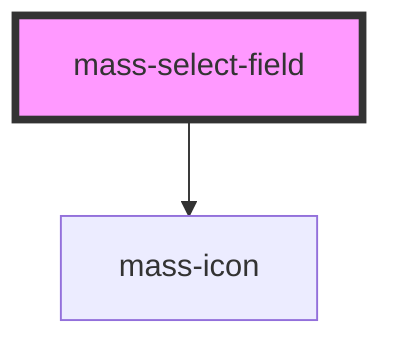

# mass-select-field

<!-- Auto Generated Below -->

## Properties

| Property               | Attribute        | Description                                                            | Type                                           | Default     |
| ---------------------- | ---------------- | ---------------------------------------------------------------------- | ---------------------------------------------- | ----------- |
| `errorMessage`         | `error-message`  | Error message to be displayed for the select field being used.         | `string`                                       | `undefined` |
| `hasError`             | `has-error`      | Variable to control wether an error message and icon are displayed.g   | `boolean`                                      | `undefined` |
| `inputId` _(required)_ | `input-id`       | ID of the select field being used.                                     | `string`                                       | `undefined` |
| `isDisabled`           | `is-disabled`    | Variable to control the disabled state of the select field being used. | `boolean`                                      | `undefined` |
| `label` _(required)_   | `label`          | Label of the select field being used.                                  | `string`                                       | `undefined` |
| `labelPosition`        | `label-position` |                                                                        | `"left" \| "top"`                              | `'top'`     |
| `options` _(required)_ | `options`        | User's list of options to be rendered in the select field              | `string \| { name: string; value: string; }[]` | `undefined` |
| `type`                 | `type`           | Light or Dark version of select field being used.                      | `string`                                       | `undefined` |

## Events

| Event         | Description | Type                  |
| ------------- | ----------- | --------------------- |
| `valueChange` |             | `CustomEvent<string>` |

## Dependencies

### Depends on

- [mass-icon](../mass-icon)

### Graph

----------------------------------------------

*Built with [StencilJS](https://stenciljs.com/)*
