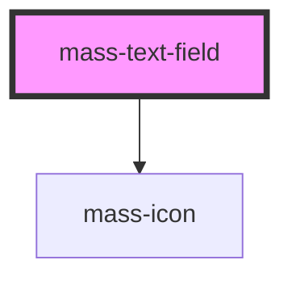

# mass-text-field

<!-- Auto Generated Below -->

## Properties

| Property                 | Attribute          | Description                                                                                                                                                                                                                                                                                                                                                                                                       | Type              | Default     |
| ------------------------ | ------------------ | ----------------------------------------------------------------------------------------------------------------------------------------------------------------------------------------------------------------------------------------------------------------------------------------------------------------------------------------------------------------------------------------------------------------- | ----------------- | ----------- |
| `errorText`              | `error-text`       | Error text for the field.  If provided, and if isValid is false, will be displayed below the field.                                                                                                                                                                                                                                                                                                               | `string`          | `undefined` |
| `helpText`               | `help-text`        | Help text for the field.  If provided, will be displayed below the field. If undefined or an empty string, will not be displayed.                                                                                                                                                                                                                                                                                 | `string`          | `undefined` |
| `inputId` _(required)_   | `input-id`         | The id of the input.   Pairs the label with the input field.  Must be unique on the page.  Required.  https://developer.mozilla.org/en-US/docs/Web/HTML/Element/input#id                                                                                                                                                                                                                                          | `string`          | `undefined` |
| `inputType`              | `input-type`       | The type of the input field.   Defaults to "text".  Possible values: "text" \| "email" \| "password" \| "search" \| "tel" \| "url"  https://developer.mozilla.org/en-US/docs/Web/HTML/Element/input#type                                                                                                                                                                                                          | `string`          | `"text"`    |
| `isDisabled`             | `is-disabled`      | The disabled state of the field.  Defaults to false.  If true, the field will be disabled.  If false, the field will be enabled.                                                                                                                                                                                                                                                                                  | `boolean`         | `false`     |
| `isRequired`             | `is-required`      | Whether the field is required or not for form submission.  Defaults to false.  https://developer.mozilla.org/en-US/docs/Web/HTML/Element/input#required                                                                                                                                                                                                                                                           | `boolean`         | `false`     |
| `isValid`                | `is-valid`         | The validation state of the field.  Possible values: undefined \| true \| false  Defaults to undefined.  If undefined, the field will have default styling.  If true, the field will be styled as valid.  If false, the field will be styled as invalid.                                                                                                                                                          | `boolean`         | `undefined` |
| `labelPosition`          | `label-position`   |                                                                                                                                                                                                                                                                                                                                                                                                                   | `"left" \| "top"` | `'top'`     |
| `labelText` _(required)_ | `label-text`       | The text that appears in the field's label.   Required.                                                                                                                                                                                                                                                                                                                                                           | `string`          | `undefined` |
| `maxLength`              | `max-length`       | The maximum input length for the field.  https://developer.mozilla.org/en-US/docs/Web/HTML/Element/input#maxlength                                                                                                                                                                                                                                                                                                | `number`          | `undefined` |
| `minLength`              | `min-length`       | The minimum input length for the field.  https://developer.mozilla.org/en-US/docs/Web/HTML/Element/input#minlength                                                                                                                                                                                                                                                                                                | `number`          | `undefined` |
| `pattern`                | `pattern`          | The validation pattern for the field.  Regexp string.  https://developer.mozilla.org/en-US/docs/Web/HTML/Element/input#pattern                                                                                                                                                                                                                                                                                    | `string`          | `undefined` |
| `placeholderText`        | `placeholder-text` | The placeholder text that should appear in the field.  This should **never** be used as a substitute for a label.  Use this only as a hint for the user. See: https://developer.mozilla.org/en-US/docs/Web/HTML/Element/input#placeholders_are_not_accessible  Use `labelText` to specify the field's label.  Defaults to undefined.  https://developer.mozilla.org/en-US/docs/Web/HTML/Element/input#placeholder | `string`          | `undefined` |
| `successText`            | `success-text`     | Success text for the field.  If provided, and if isValid is true, will be displayed below the field.                                                                                                                                                                                                                                                                                                              | `string`          | `undefined` |
| `value`                  | `value`            | The value of the field passed from the parent component (if any).  Defaults to an empty string.                                                                                                                                                                                                                                                                                                                   | `string`          | `""`        |

## Events

| Event         | Description | Type                  |
| ------------- | ----------- | --------------------- |
| `valueChange` |             | `CustomEvent<string>` |

## Dependencies

### Depends on

- [mass-icon](../mass-icon)

### Graph

----------------------------------------------

*Built with [StencilJS](https://stenciljs.com/)*
