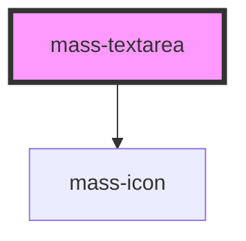

# mass-textarea

<!-- Auto Generated Below -->

## Properties

| Property      | Attribute     | Description                | Type      | Default                    |
| ------------- | ------------- | -------------------------- | --------- | -------------------------- |
| `errorMsg`    | `error-msg`   | Text for the error message | `string`  | `"Error explanation text"` |
| `isDisabled`  | `is-disabled` | Is disabled state          | `boolean` | `false`                    |
| `isError`     | `is-error`    | Is Error state             | `boolean` | `false`                    |
| `isRequired`  | `is-required` | Is text box required       | `boolean` | `false`                    |
| `label`       | `label`       | title of input             | `string`  | `''`                       |
| `maxLength`   | `max-length`  | Max Length of text box     | `number`  | `250`                      |
| `minLength`   | `min-length`  | Min Length of text box     | `number`  | `0`                        |
| `placeholder` | `placeholder` | input for placeholder text | `string`  | `''`                       |
| `textareaId`  | `textarea-id` | custom id for text area    | `string`  | `'my-textarea'`            |
| `value`       | `value`       | Value of text box          | `string`  | `''`                       |

## Events

| Event        | Description                | Type               |
| ------------ | -------------------------- | ------------------ |
| `massChange` | Handle on change and value | `CustomEvent<any>` |

## Dependencies

### Depends on

- [mass-icon](../mass-icon)

### Graph

----------------------------------------------

*Built with [StencilJS](https://stenciljs.com/)*
